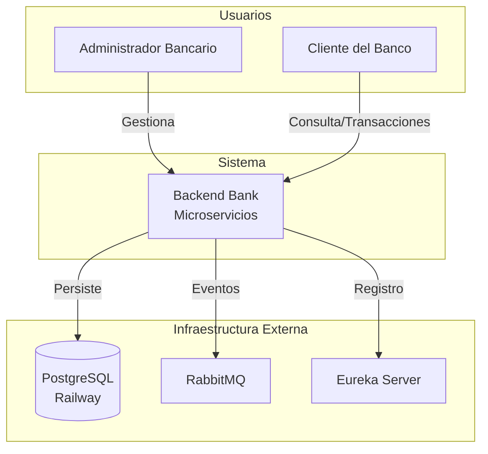
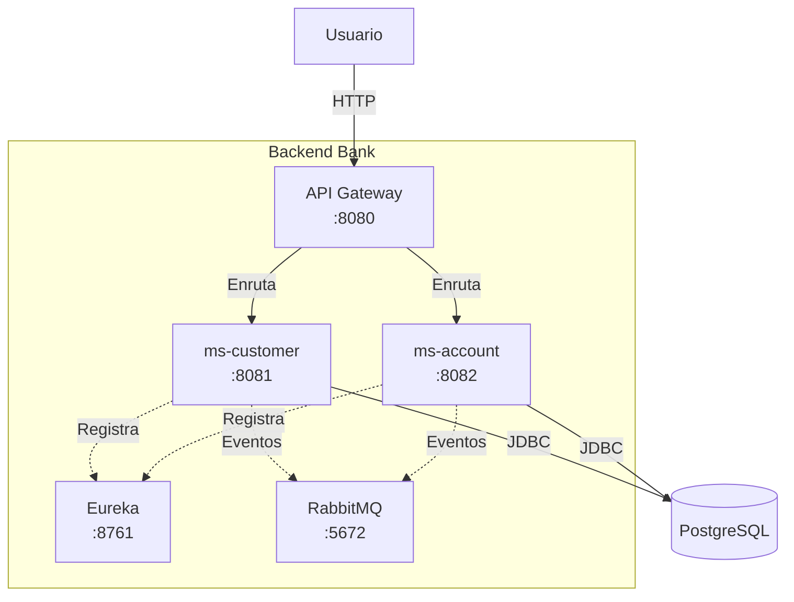
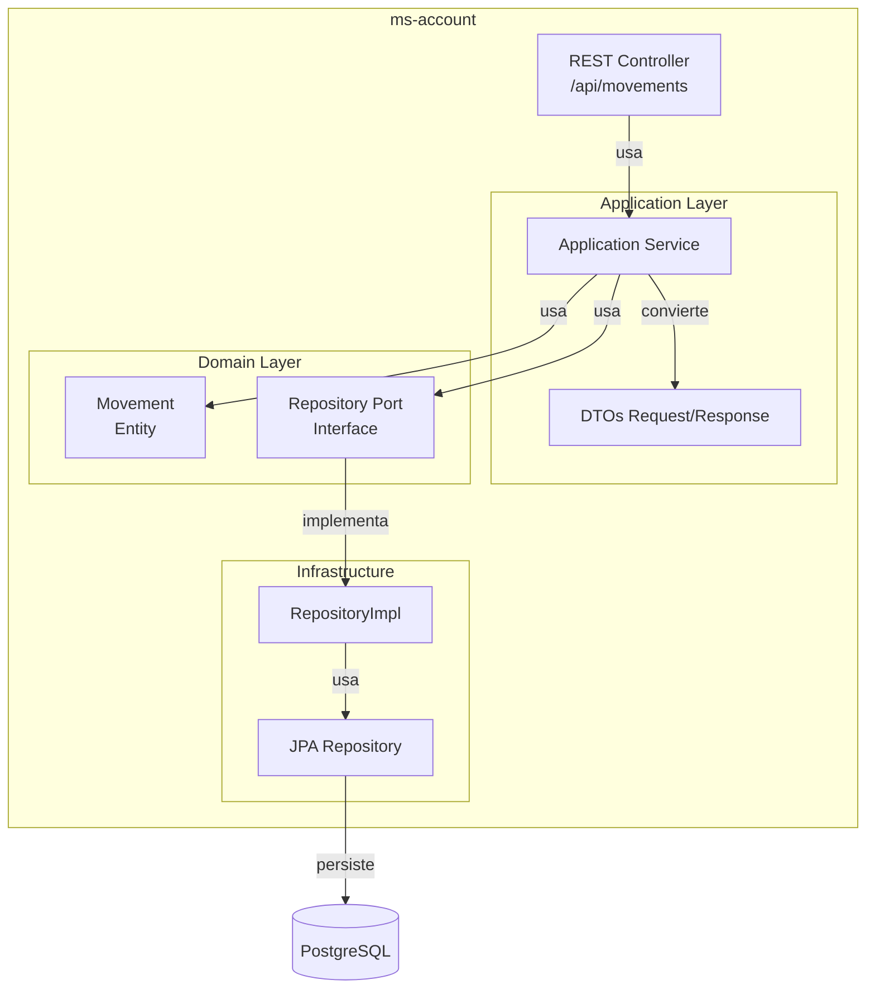

<p align="center">
  
  
  
  
  
  
  
</p>

<h1 align="center">🏦 Backend Bank</h1>
<p align="center"><strong>Sistema Bancario con Arquitectura Hexagonal</strong></p>

<p align="center">
  <a href="#arquitectura">Arquitectura</a> •
  <a href="#diagramas-c4">Diagramas C4</a> •
  <a href="#por-que-hexagonal">¿Por qué Hexagonal?</a> •
  <a href="#decisiones-de-diseño">Decisiones de Diseño</a> •
  <a href="#docker">Docker</a> •
  <a href="#ci-cd">CI/CD</a>
</p>

---

## 📋 Tabla de Contenidos

- [Descripción del Sistema](#descripción-del-sistema)
- [Arquitectura Hexagonal](#arquitectura-hexagonal)
  - [¿Por qué elegimos Hexagonal?](#por-qué-elegimos-hexagonal)
  - [Las 3 Capas](#las-3-capas)
  - [Flujo de Datos](#flujo-de-datos)
  - [Estructura de Paquetes](#estructura-de-paquetes)
- [Decisiones de Diseño](#decisiones-de-diseño)
  - [Command Objects](#command-objects)
  - [Eventos de Dominio](#eventos-de-dominio)
  - [Comunicación Asíncrona](#comunicación-asíncrona)
  - [Mappers y Validación](#mappers-y-validación)
- [Diagramas C4](#diagramas-c4)
- [Stack Tecnológico](#stack-tecnológico)
- [Microservicios](#microservicios)
- [Tests y Calidad](#tests-y-calidad)
- [Docker Compose](#docker-compose)
- [Integraciones Futuras](#integraciones-futuras)
- [Valor Agregado](#valor-agregado)

---

## 📝 Descripción del Sistema

**Backend Bank** es un sistema bancario de microservicios diseñado para gestionar clientes, cuentas y transacciones financieras. Implementa los requisitos funcionales F1-F7 con énfasis en:

- **Escalabilidad**: Microservicios independientes
- **Mantenibilidad**: Arquitectura Hexagonal (Ports & Adapters)
- **Testabilidad**: Tests unitarios e integración desacoplados
- **Flexibilidad**: Capacidad de cambiar tecnologías sin afectar el negocio

### Funcionalidades Principales

| Funcionalidad | Descripción | Estado |
|---------------|-------------|--------|
| **F1** | Gestión de Clientes y Cuentas (CRUD) | ✅ Completo |
| **F2** | Registro de Movimientos (Depósitos/Retiros) | ✅ Completo |
| **F3** | Validación de "Saldo no disponible" | ✅ Completo |
| **F4** | Reportes por rango de fechas | ✅ Completo |
| **F5** | Pruebas Unitarias | ✅ **246 tests** |
| **F6** | Pruebas de Integración | ✅ **60+ escenarios Karate** |
| **F7** | Docker y Despliegue | ✅ Docker Compose (5 servicios) |

---

## 🏗️ Arquitectura Hexagonal

### ¿Qué es la Arquitectura Hexagonal?

La **Arquitectura Hexagonal** (también llamada *Ports and Adapters* o *Arquitectura de Cebolla*) es un patrón de diseño que organiza el código en capas concéntricas, donde:

- **El Dominio** está en el centro (sin dependencias externas)
- **La Aplicación** rodea al dominio (casos de uso)
- **La Infraestructura** está en la periferia (detalles técnicos)

```
┌─────────────────────────────────────────────────────────────┐
│                    INFRAESTRUCTURA                           │
│  ┌─────────────────────────────────────────────────────┐   │
│  │                    APLICACIÓN                        │   │
│  │  ┌─────────────────────────────────────────────┐     │   │
│  │  │              DOMINIO (Core)                │     │   │
│  │  │                                             │     │   │
│  │  │   Entidades de Negocio (sin frameworks)    │     │   │
│  │  │   Interfaces (Ports)                       │     │   │
│  │  │   Reglas de Negocio                        │     │   │
│  │  │                                             │     │   │
│  │  └─────────────────────────────────────────────┘     │   │
│  │                                                      │   │
│  │   Casos de Uso (Application Services)               │   │
│  │   DTOs y Mappers                                     │   │
│  └─────────────────────────────────────────────────────┘   │
│                                                             │
│   REST Controllers, JPA Repositories, RabbitMQ, etc.      │
└─────────────────────────────────────────────────────────────┘
```

### Las 3 Capas

#### 1. 💛 Capa de Dominio (El Núcleo)

**Responsabilidad**: Contener la lógica de negocio pura, sin dependencias de frameworks.

**Contenido**:
- **Entidades**: Objetos de negocio (Account, Movement, Client, Person)
- **Ports**: Interfaces organizadas por dirección:
  - `domain/port/in/` — **Input Ports**: lo que el dominio ofrece (ej: `ClientService`, `MovementService`)
  - `domain/port/out/` — **Output Ports**: lo que el dominio necesita (ej: `ClientRepository`, `DomainEventPublisher`)
- **Eventos**: Records inmutables (ej: `ClientEvent`, `DomainEvent`)
- **Excepciones**: Errores específicos del dominio

**Características**:
- ❌ No usa `@Entity` de JPA
- ❌ No usa `@Service` de Spring
- ❌ No importa `org.springframework.*`
- ✅ Solo depende de `java.*` (JDK puro)
- ✅ Contiene las reglas de negocio y validaciones

**Ejemplo de Reglas**:
- Un retiro solo puede hacerse si hay saldo suficiente (F3)
- Una cuenta inactiva no permite movimientos
- El tipo de cuenta solo puede ser "Ahorro" o "Corriente"

#### 2. 🧡 Capa de Aplicación (Casos de Uso)

**Responsabilidad**: Orquestar el flujo de datos entre el dominio y la infraestructura.

**Contenido**:
- **Application Services**: Coordinan casos de uso (ej: "Realizar Depósito")
- **DTOs**: Objetos de transferencia de datos (Request/Response)
- **Mappers**: Convierten entre DTOs y Entidades de Dominio

**Características**:
- Usa Spring (`@Service`) para inyección de dependencias
- Depende de las interfaces del Dominio (no de implementaciones)
- No contiene lógica de negocio (solo orquestación)

**Flujo típico**:
1. Recibe DTO del controller
2. Valida entrada (con Bean Validation)
3. Convierte DTO a Entidad de Dominio
4. Llama a métodos del Dominio
5. Persiste a través de Ports (interfaces)
6. Convierte resultado a DTO de respuesta

#### 3. 💙 Capa de Infraestructura (Adaptadores)

**Responsabilidad**: Implementar los detalles técnicos y adaptar el dominio al mundo exterior.

**Contenido**:
- **REST Controllers**: Exponen API HTTP
- **JPA Repositories**: Persisten en PostgreSQL
- **Message Publishers**: Envían eventos a RabbitMQ
- **Mappers**: Convierten entre JPA Entities y Entidades de Dominio

**Características**:
- Conoce Spring, JPA, RabbitMQ, etc.
- Implementa las interfaces (Ports) definidas en el Dominio
- Puede cambiar sin afectar el Dominio (ej: PostgreSQL → MongoDB)

### Flujo de Datos

Cuando un cliente hace un **depósito**, el flujo es:

```
1. HTTP Request → REST Controller (Infrastructure)
   POST /api/movements/123/deposit
   Body: 600.00

2. Controller → Application Service
   Llama a movementService.createDeposit("123", 600.00)

3. Application Service → Dominio
   - Busca la cuenta (a través del Port)
   - Cuenta.deposit(600.00)  ← Lógica de negocio
   - Crea Movement.createDeposit("123", 600.00, nuevoBalance)
   - Guarda el movimiento (a través del Port)

4. Application Service → Infrastructure (RepositoryImpl)
   - Implementación del Port guarda en PostgreSQL
   - Convierte Dominio → JPA Entity

5. HTTP Response ← Controller
   Devuelve MovementResponseDto con datos del movimiento
```

**La magia**: El Dominio no sabe que existe HTTP, Spring o PostgreSQL. Solo sabe de "Cuentas", "Movimientos" y "Reglas de Negocio".

### Estructura de Paquetes

La estructura de carpetas refleja explícitamente la dirección de las dependencias:

```
ms-customer/                          ms-account/
│                                     │
├── domain/                           ├── domain/
│   ├── port/                         │   ├── port/
│   │   ├── in/         ← Input Ports │   │   ├── in/         ← Input Ports
│   │   │   └── ClientService         │   │   │   ├── MovementService
│   │   └── out/        ← Output Ports│   │   │   └── ClientEventHandler
│   │       ├── ClientRepository      │   │   └── out/        ← Output Ports
│   │       └── DomainEventPublisher  │   │       ├── AccountRepository
│   ├── entity/                       │   │       └── MovementRepository
│   ├── event/                        │   ├── entity/
│   └── exception/                    │   ├── event/
│                                      │   └── exception/
├── application/                      ├── application/
│   ├── dto/                          │   ├── dto/
│   ├── mapper/                       │   ├── mapper/
│   ├── port/                         │   └── service/
│   │   └── in/                       │
│   │       └── command/   ← Commands │   ├── infrastructure/
│   └── service/                      │       ├── rest/
│                                      │       ├── persistence/
├── infrastructure/                   │       ├── messaging/
│   ├── rest/                         │       └── exception/
│   ├── persistence/                  │
│   ├── messaging/                    │
│   ├── config/                       │
│   └── exception/                    │
```

**Principio**: `port/in/` contiene lo que el dominio **ofrece** al mundo exterior. `port/out/` contiene lo que el dominio **necesita** del mundo exterior. La capa de aplicación depende de ambos, la infraestructura implementa los `port/out/`.

---

## 📊 Diagramas C4

Los diagramas C4 describen la arquitectura en 4 niveles de abstracción:

### C1 - Contexto del Sistema

Muestra el sistema como una caja negra y sus interacciones con usuarios y sistemas externos.



**Descripción**: Los usuarios interactúan con el Sistema Bancario, que persiste datos en PostgreSQL, envía eventos por RabbitMQ y se registra en Eureka para descubrimiento de servicios.

### C2 - Contenedores (Microservicios)

Muestra los contenedores (aplicaciones/procesos) que componen el sistema.



**Descripción**:
- **API Gateway**: Punto de entrada único, enruta peticiones a los microservicios
- **ms-customer**: Gestiona clientes (CRUD, activación/desactivación)
- **ms-account**: Gestiona cuentas y movimientos (F1, F2, F3, F4)
- **Eureka**: Registro y descubrimiento de servicios
- **RabbitMQ**: Comunicación asíncrona entre servicios

### C3 - Componentes (ms-account)

Muestra los componentes internos de un microservicio.



**Descripción**:
1. **Controller**: Recibe HTTP requests
2. **Application Service**: Orquesta el caso de uso
3. **Domain**: Ejecuta lógica de negocio pura
4. **Repository Port**: Interfaz definida en dominio
5. **RepositoryImpl**: Implementación JPA (adaptador)

### C4 - Código (Estructura)

Muestra la estructura de código a nivel de clases y la dirección de las dependencias.

```
ms-account/
├── domain/
│   ├── port/
│   │   ├── in/                    ← Input Ports (lo que el dominio ofrece)
│   │   │   ├── MovementService.java
│   │   │   └── ClientEventHandler.java
│   │   └── out/                   ← Output Ports (lo que el dominio necesita)
│   │       ├── AccountRepository.java
│   │       └── MovementRepository.java
│   ├── entity/
│   │   ├── Account.java           ← Lógica de negocio pura
│   │   └── Movement.java
│   └── exception/
│       └── InsufficientBalanceException.java
│
├── application/
│   ├── dto/
│   │   ├── MovementRequestDto.java
│   │   ├── MovementResponseDto.java
│   │   └── TransactionRequestDto.java
│   ├── mapper/
│   │   └── MovementApplicationMapper.java
│   └── service/
│       ├── MovementApplicationService.java
│       └── AccountApplicationService.java
│
└── infrastructure/
    ├── rest/
    │   ├── MovementController.java
    │   ├── AccountController.java
    │   └── ReportController.java
    ├── persistence/
    │   ├── entity/
    │   │   └── MovementJpaEntity.java
    │   ├── repository/
    │   │   └── MovementJpaRepository.java
    │   ├── mapper/
    │   │   └── MovementJpaMapper.java
    │   └── MovementRepositoryImpl.java
    ├── messaging/
    │   └── RabbitMQConsumer.java
    ├── config/
    │   └── RabbitMQConfig.java
    └── exception/
        └── GlobalExceptionHandler.java
```

---

## 🧠 ¿Por qué Elegimos Hexagonal?

### Problema que Resolvemos

En arquitecturas tradicionales (Layered/N-capas), el código de negocio está mezclado con el framework:

```java
// ❌ Arquitectura Tradicional (acoplada)
@Entity  // JPA
public class Account {
    @Id  // JPA
    private Long id;
    
    @Column  // JPA
    private String accountNumber;
}

// Si queremos cambiar JPA → MongoDB, debemos refactorizar TODO
```

**Problemas**:
- Los tests requieren levantar Spring + BD
- No podemos cambiar de tecnología sin romper el negocio
- Las reglas de negocio están escondidas entre anotaciones

### La Solución: Dominio Desacoplado

```java
// ✅ Arquitectura Hexagonal (desacoplada)
public class Account {  // Pura, sin anotaciones
    private Long id;
    private String accountNumber;
    
    public void withdraw(BigDecimal amount) {
        if (balance.compareTo(amount) < 0) {
            throw new InsufficientBalanceException("Saldo no disponible");
        }
        this.balance = this.balance.subtract(amount);
    }
}

// JPA está en otra clase (JpaEntity)
// MongoDB estaría en otra clase (MongoDocument)
// El Dominio NO sabe de BD
```

### Beneficios concretos

#### 1. 🔄 Cambio de Base de Datos sin Dolor

**Escenario**: Migrar de PostgreSQL a MongoDB

```
Sin Hexagonal:
├── Buscar @Entity en todo el código
├── Cambiar anotaciones JPA por MongoDB
├── Reescribir queries
├── Actualizar tests
└── 2-3 semanas de trabajo

Con Hexagonal:
├── Crear nueva implementación de Repository (1 archivo)
├── Crear nuevo JpaMapper (1 archivo)
├── Cambiar inyección de dependencias
└── 2-3 días de trabajo
```

**Lo que NO cambia**:
- `Movement.java` (dominio)
- `MovementRepository.java` (interface)
- `MovementApplicationService.java` (aplicación)
- Todos los tests unitarios del dominio

#### 2. 🧪 Tests Ultra-Rápidos

Los tests del dominio no necesitan:
- ❌ Base de datos
- ❌ Spring Context (30 segundos de carga)
- ❌ Docker
- ❌ Mocks complejos

**Comparación de velocidad**:

| Tipo | Tradicional | Hexagonal |
|------|-------------|-----------|
| Test unitario | 2-3 segundos | 10-20 milisegundos |
| Suite completa | 2-3 minutos | 5-10 segundos |
| Feedback loop | Lento | Rápido |

#### 3. 🔌 Integraciones Futuras Sencillas

**Ejemplo**: Agregar un servicio de Auditoría externo

```
Sin modificar el Dominio:
1. Crear interfaz AuditPort en Domain
2. Crear AuditService en Application  
3. Implementar AuditApiClient en Infrastructure
4. Inyectar en Application Service

El Dominio solo conoce la interfaz AuditPort.
La implementación (REST, gRPC, SQS) es un detalle.
```

#### 4. 📦 Estructura que "Grita" la Arquitectura

Al ver los paquetes, inmediatamente entendemos:

```
ms-account/
├── domain/           ← Aquí está el dinero (reglas de negocio)
├── application/      ← Casos de uso (qué hace el sistema)
└── infrastructure/   ← Detalles técnicos (cómo lo hace)
```

**Principio**: La estructura de carpetas refleja la arquitectura.

---

## 🧠 Decisiones de Diseño

### Command Objects

Cada caso de uso recibe un objeto comando específico en lugar de la entidad de dominio directamente:

| Antes | Después |
|-------|---------|
| `clientService.createClient(Client client)` | `clientService.createClient(CreateClientCommand command)` |
| `clientService.updateClient(Client client)` | `clientService.updateClient(UpdateClientCommand command)` |

**Beneficios**:
- La API del caso de uso no está acoplada a la entidad de dominio
- El mapper construye la entidad con validaciones internas
- Los comandos son records inmutables que documentan la entrada esperada

```java
public record CreateClientCommand(
    String name, String gender, Integer age,
    String identification, String address,
    String phone, String password, Boolean active
) {}
```

### Eventos de Dominio

Los eventos usan **records de Java** para garantizar inmutabilidad:

```java
public record ClientEvent(
    String eventId, String eventType, Instant occurredOn, String source,
    Long clientId, String identification,
    String name, String phone, String address, Boolean active
) implements DomainEvent { ... }
```

**Características**:
- **Factory methods desde entidad**: `ClientEvent.fromCreated(client)` — la construcción del evento vive en el evento, no en el servicio
- **Sin duplicación de datos**: todos los campos son planos, sin payload redundante
- **Compact constructor** con validación de campos obligatorios
- **5 tipos**: `CLIENT_CREATED`, `UPDATED`, `DELETED`, `ACTIVATED`, `DEACTIVATED`

### Comunicación Asíncrona

**ms-customer → RabbitMQ → ms-account**

```
ms-customer publica CLIENT_CREATED  →  Exchange "customer.events"
                                    →  Queue "customer.events.queue"
                                    →  ms-account RabbitMQConsumer
                                    →  ClientEventHandlerImpl
                                    →  clientNameCache (ConcurrentHashMap)
```

ms-account mantiene una **proyección local** (`ConcurrentHashMap<Long, String>`) con los nombres de clientes. Esto evita llamadas HTTP síncronas entre servicios y permite que el reporte F4 resuelva nombres sin acoplamiento.

### Mappers y Validación

- **MapStruct con `unmappedTargetPolicy = ReportingPolicy.ERROR`**: si se agrega un campo nuevo al DTO o la entidad y no se mapea, el proyecto **no compila**
- **Doble capa de validación**: Bean Validation en DTOs (formato) + validación en constructores de dominio (reglas de negocio)
- **Default de `active` se maneja explícitamente** en el mapper (no se confía en `defaultValue` de MapStruct que no funciona con constructores)

---

### Core
- **Java 17**: Lenguaje moderno con records, pattern matching, mejoras en NullPointer
- **Spring Boot 3.2**: Framework con inyección de dependencias, web, data
- **Spring Cloud**: Eureka (service discovery), Gateway (routing)

### Persistencia
- **PostgreSQL 15**: Base de datos relacional robusta
- **Spring Data JPA**: Abstracción sobre JDBC, queries automáticas
- **HikariCP**: Connection pool de alto rendimiento

### Comunicación
- **RabbitMQ**: Message broker para eventos asíncronos
- **REST**: Comunicación síncrona HTTP/JSON

### Testing
- **JUnit 5**: Tests unitarios modernos (params, extensions)
- **Mockito**: Mocking de dependencias
- **Karate DSL**: Tests de integración BDD
- **Jacoco**: Reportes de cobertura

### DevOps
- **Docker**: Contenerización de servicios
- **Docker Compose**: Orquestación local
- **GitHub Actions**: CI/CD automatizado

---

## 🧩 Microservicios

### 1. 🔍 ms-eureka-server (Port: 8761)
**Responsabilidad**: Registro y descubrimiento de servicios.

**Stack**: Spring Boot 3.2.0 + Spring Cloud Netflix Eureka Server 4.2.0

**Por qué**: En microservicios, los servicios necesitan encontrarse dinámicamente. Eureka mantiene un registro de qué instancias están disponibles.

**Tests**: ✅ 6 tests smoke (contexto, propiedades, standalone mode)

### 2. 🚪 ms-gateway (Port: 8080)
**Responsabilidad**: Punto de entrada único, enrutamiento y balanceo de carga.

**Stack**: Spring Cloud Gateway 2023.0.1

**Rutas**:
| Ruta | Destino | ID |
|------|---------|----|
| `/api/clients/**` | `lb://ms-customer` | `ms-customer` |
| `/api/accounts/**` | `lb://ms-account` | `ms-account` |
| `/api/movements/**` | `lb://ms-account` | `ms-account-movements` |

**Tests**: ✅ 12 tests (contexto, rutas, predicates, Eureka)

### 3. 👤 ms-customer (Port: 8081)
**Responsabilidad**: Gestión del ciclo de vida de clientes.

**Stack**: Spring Boot 3.2.0, PostgreSQL (schema: customer), RabbitMQ Publisher

**Arquitectura**:
```
domain/port/in/  ← ClientService (interfaz del caso de uso)
domain/port/out/ ← ClientRepository, DomainEventPublisher
```

**Arquitectura Hexagonal**:
- **Dominio**: `Client` (herencia de `Person`), eventos como records, puertos `in/` y `out/`
- **Aplicación**: `CreateClientCommand`, `UpdateClientCommand`, `ClientApplicationMapper`
- **Infraestructura**: REST Controller, JPA, RabbitMQ Event Publisher

**Funcionalidades**:
- CRUD completo de clientes con validación en doble capa (DTO + Dominio)
- Activación/desactivación con métodos explícitos (`activate()`/`deactivate()`)
- Eventos de dominio publicados en RabbitMQ al crear/actualizar/eliminar clientes
- Documentación API con Swagger/OpenAPI

**Tests**: ✅ **81 tests** (dominio + aplicación)

### 4. 💰 ms-account (Port: 8082)
**Responsabilidad**: Gestión de cuentas, movimientos y reportes.

**Stack**: Spring Boot 3.2.0, PostgreSQL (schema: account), RabbitMQ Consumer

**Arquitectura**:
```
domain/port/in/  ← MovementService, ClientEventHandler (input ports)
domain/port/out/ ← AccountRepository, MovementRepository (output ports)
```

**Funcionalidades**:
- CRUD de cuentas (Ahorro/Corriente) con validación de tipo y saldo
- Depósitos y retiros con registro histórico de movimientos (F2)
- Validación "Saldo no disponible" para sobregiros (F3)
- Reportes por rango de fechas con nombre de cliente (F4)
- Consumidor RabbitMQ para eventos de cliente (proyección local con `ConcurrentHashMap`)

**Flujo de Depósito**:
```
1. Recibir MovementRequestDto
2. Buscar cuenta por número (AccountRepository)
3. Validar que la cuenta está activa
4. Ejecutar account.deposit(amount) — dominio puro
5. Movement.createDeposit() — factory method
6. Persistir cuenta y movimiento
7. Retornar MovementResponseDto
```

**Tests**: ✅ **153 tests** (dominio + aplicación)

---

## 🧪 Tests y Calidad

### Resumen de Cobertura

| Tipo | Framework | Cantidad | Tiempo de ejecución |
|------|-----------|----------|---------------------|
| **Unitarios (dominio)** — entidades, excepciones | JUnit 5 | ~120 | < 1s |
| **Unitarios (aplicación)** — servicios con Mockito | JUnit 5 + Mockito | ~80 | < 2s |
| **Unitarios (infraestructura)** — contexto, rutas | Spring Boot Test | ~46 | < 15s |
| **Integración API** — end-to-end | Karate Framework | ~60 escenarios | ~30s |
| **Total** | | **~306** | ~48s |

### Distribución por Microservicio

| Microservicio | Tests | Capas cubiertas |
|---------------|-------|-----------------|
| **ms-customer** | **81** | Dominio (entidades, excepciones) + Aplicación (servicios mockeados) |
| **ms-account** | **153** | Dominio (entidades, excepciones) + Aplicación (servicios mockeados) |
| **ms-gateway** | **12** | Infraestructura (contexto Spring, rutas, predicates) |
| **ms-eureka-server** | **6** | Infraestructura (contexto Spring, propiedades) |

### Filosofía de Testing

```
         /\
        /  \
       / E2E\          ← Karate (60+ escenarios)
      /________\
     /          \
    /Integration \      ← API Tests
   /______________\
  /                \
 /   Unit Tests     \   ← JUnit (246 tests)
/____________________\
```

### Pirámide Hexagonal

Los tests siguen la misma arquitectura hexagonal:

```
Tests de Dominio (puros, sin Spring)
  ├── AccountTest       → 50 tests
  ├── ClientTest        → 25 tests
  ├── MovementTest      → 44 tests
  ├── PersonTest        → 11 tests
  └── Exception tests   → 30 tests

Tests de Aplicación (Mockito, sin BD)
  ├── ClientServiceImplTest     → 22 tests
  ├── AccountServiceTest        → 20 tests
  └── MovementApplicationServiceTest → 30 tests

Tests de Infraestructura (Spring Boot Test)
  ├── GatewayApplicationTest    → 4 tests
  ├── GatewayRoutesTest         → 8 tests
  └── EurekaServerApplicationTest → 6 tests
```

### Características

| Tipo | Velocidad | Dependencias | Framework |
|------|-----------|--------------|-----------|
| Dominio | ⚡ < 1s | Ninguna (JDK puro) | JUnit 5 |
| Aplicación | ⚡ < 2s | Mockito (sin BD, sin Spring) | JUnit 5 + Mockito |
| Infraestructura | 🟡 < 15s | Spring Context | Spring Boot Test |
| Integración | 🟡 ~30s | Todos los servicios | Karate DSL |

### Patrones de Testing

**Tests de Dominio** — sin Spring, sin BD:
```java
@Test
void shouldRejectWithdrawalWhenInsufficientBalance() {
    Account account = new Account("478758", "Ahorro", BigDecimal.ZERO, true, 1L);
    assertThrows(InsufficientBalanceException.class, () -> account.withdraw(new BigDecimal("100")));
}
```

**Tests de Aplicación** — con Mockito:
```java
@ExtendWith(MockitoExtension.class)
class AccountServiceTest {
    @Mock AccountRepository accountRepository;
    @Mock AccountApplicationMapper accountMapper;

    @Test
    void shouldCreateAccountSuccessfully() {
        when(accountRepository.existsByAccountNumber("478758")).thenReturn(false);
        when(accountMapper.toDomain(requestDto)).thenReturn(account);
        when(accountRepository.save(account)).thenReturn(account);
        // ...
    }
}
```

**Tests de Integración Karate** — DSL declarativo:
```gherkin
Escenario: F3 - Retiro rechazado por saldo insuficiente
  Dado que existe una cuenta con saldo 0
  Cuando intento retirar 100
  Entonces recibo error 400
  Y el mensaje es "Saldo no disponible"
  Y el saldo permanece en 0
```

---

## 🐳 Docker Compose

### Servicios

| Servicio | Descripción | Memoria | Puertos |
|----------|-------------|---------|---------|
| **RabbitMQ** | Message broker | 512M | 5672, 15672 |
| **Eureka** | Service discovery | 512M | 8761 |
| **Gateway** | API Gateway | 512M | 8080 |
| **ms-customer** | Gestión clientes | 768M | 8081 |
| **ms-account** | Gestión cuentas | 768M | 8082 |

### Configuración de Memoria JVM

Cada servicio tiene límites de memoria optimizados:

```yaml
# Ejemplo ms-account
JAVA_OPTS: "-Xms256m -Xmx512m -XX:MaxRAMPercentage=75.0"
# Heap inicial: 256MB
# Heap máximo: 512MB (50% del contenedor)
# Metaspace: 128MB
```

### Comandos Útiles

```bash
# Iniciar todo el stack
docker-compose up -d

# Ver logs
docker-compose logs -f ms-account

# Escalar un servicio (2 instancias)
docker-compose up -d --scale ms-account=2

# Detener todo
docker-compose down

# Reconstruir imágenes
docker-compose up -d --build
```

---

## 🚀 Integraciones Futuras

### Servicio de Auditoría

**Escenario**: Registrar todas las operaciones para compliance.

**Implementación**:
1. Crear interfaz `AuditPort` en Dominio
2. Crear `AuditApplicationService` en Aplicación
3. Crear `AuditApiClient` en Infraestructura (llama a API externa)
4. Inyectar en servicios existentes

**Ventaja**: El Dominio no sabe si la auditoría va a BD, API o SQS.

### Cambio a SQS (Amazon Simple Queue Service)

**Escenario**: Migrar de RabbitMQ a SQS en AWS.

**Solo cambia Infraestructura**:
- Reemplazar `RabbitMQEventPublisher` → `SQSEventPublisher`
- Mismo interface `EventPublisher` (Dominio)
- Sin cambios en Aplicación ni Dominio

### Cambio de Base de Datos

**Escenario**: Migrar de PostgreSQL a MongoDB.

**Solo cambia Infraestructura**:
- Crear `AccountMongoRepository` implementando `AccountRepository`
- Crear `AccountMongoEntity` y `AccountMongoMapper`
- Mismo Dominio, misma Aplicación

---

## 💎 Valor Agregado

### Para el Negocio

| Aspecto | Beneficio |
|---------|-----------|
| **Tiempo de cambio** | Reducción de 80% al cambiar tecnologías |
| **Calidad** | Tests más rápidos y confiables |
| **Escalabilidad** | Microservicios independientes |
| **Mantenibilidad** | Código organizado por responsabilidad |

### Para Desarrolladores

| Aspecto | Beneficio |
|---------|-----------|
| **Feedback rápido** | Tests en segundos, no minutos |
| **Menos bugs** | Lógica de negocio aislada y testeada |
| **Cambios seguros** | Refactoring sin miedo a romper |
| **Onboarding** | Estructura clara, fácil de entender |

### Para DevOps

| Aspecto | Beneficio |
|---------|-----------|
| **Contenedores** | Cada servicio es independiente |
| **Escalado selectivo** | Solo escalar lo que se necesita |
| **Monitoreo** | Health checks por servicio |
| **Despliegue** | CI/CD automatizado con GitHub Actions |

---

## 🎯 Conclusión

Este proyecto demuestra que la **Arquitectura Hexagonal** no es solo teoría: es una herramienta práctica que resuelve problemas reales de acoplamiento, testabilidad y mantenibilidad.

La clave está en la **separación de responsabilidades**:
- El **Dominio** decide QUÉ hacer (reglas de negocio)
- La **Aplicación** decide CUÁNDO hacerlo (orquestación)
- La **Infraestructura** decide CÓMO hacerlo (detalles técnicos)

Esta separación nos permite evolucionar el sistema sin temor, testear rápidamente y escalar según las necesidades del negocio.

---

<p align="center">
  <strong>Construido con Arquitectura Hexagonal 🏗️</strong><br>
  Dominio puro • Tests confiables • Cambios seguros
</p>
